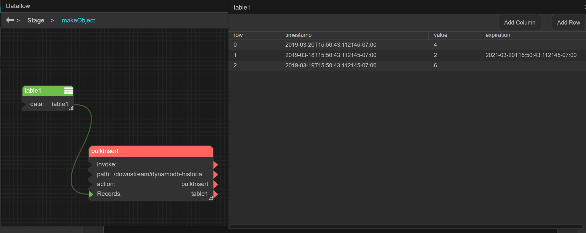
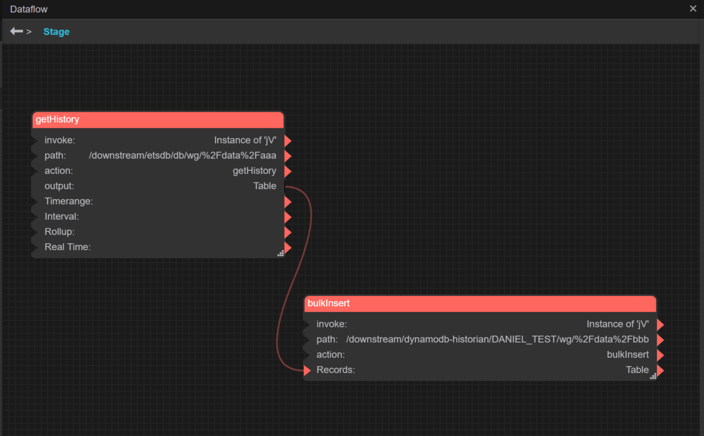

# dslink-java-historian-dynamodb

A historian DSLink using DynamoDB as the backend driver.

## Usage guide

### Set Credentials

When first launching the link, you must invoke the `Set Credentials` action with your AWS Access Key ID and Secret Access Key. These credentials will then be stored in the nodes.json file and will persist across restarts.

### Add Database

This action sets up a connection to a DynamoDB database in order to use it for storing DSA histories. After invoking this action, you will have a database node with the same functionality as a database node in the ETSDB DSLink, except that it uses an Amazon DynamoDB table instead of a directory on the local file system.

- `Table` - You may either select `CREATE NEW TABLE` to create a new DynamoDB table, or choose an existing table from the drop-down. If you choose an existing table, the rest of the parameters to this action will be ignored. Note that using an existing table will only work if the table was created using this DSLink, otherwise the format will be incompatible.
- `New Table Name` - The name of the new table to be created
- `New Table Read Capacity Units` - The number of RCUs to provision for the new table
- `New Table Write Capacity Units` - The number of WCUs to provision for the new table

### Create Watch Group

This action creates a node that acts as a folder for grouping watch paths, and which provides several actions for interacting with its watch paths. Note that this is a convenience function of the DSLink, and does not correspond to anything in the underlying DynamoDB table.

### Watch Group Actions

- `Edit` - This action allows you to specify how often and under what conditions to store records for the watch paths in this watch group.
- `Restore GetHistory aliases` - This action re-sets the GetHistory aliases on the DSA points corresponding to the watch paths in this watch group.
- `Add Watch Path` - Enter a DSA path to begin trending the corresponding point.
- `Delete` - Delete this watch group and stop trending all of its watch paths.

### Wath Path Actions

- `Get History` - Retreive a table of the values of this watch path for the specified time range.
- `Unsubscribe` - Stop trending this watch path and remove it from the watch group
- `Purge` - Purge records for this watch path from the database for the specified time period. Note that purging records from DynamoDB consumes Write Capacity Units, so consider enabling TTL instead if you simply need to regularly delete old records.
- `Unsubscribe and Purge` - Stop trending this watch path, remove it from the watch group, and purge all of its records from the database.
- `Overwrite History` - For the specified time range, rewrite the records for this watch path to contain the specified value.
- `Insert Record` - Manually insert a record into the database.
- `Bulk Insert Records` - Manually insert multiple records into the database. This action takes an array of records, which can be in the form of maps, arrays, or strings:
  - If maps: Each record should contain values for `timestamp`, `value`, and optionally `expiration`. ([example](#screenshot1)) (This method is pretty clunky)
  - If arrays: Each record should contain its timestamp, followed by its value, optionally followed by its expiration. It is also ok if the record starts with an id. ([example](#screenshot2)) (This is probably the easiest method)
  - If strings: Same as arrays, but represented as strings. ([example](#screenshot3))
  - Also note that the table output by a GetHistory action (of this DSLink or the ETSDB DSLink) can be used as input to this action. ([example](#screenshot4))

### Time-To-Live Settings

Since DynamoDB does not distinguish between delete and write operations, automatically purging older records can be expensive. Instead, DynamoDB provides TTL functionality, allowing us to specify, when creating a record, when Amazon should automoatically delete that record. To make use of this, whenever the DSLink creates a record, it gives it an `expiration` attribute - the date and time the record should be deleted if TTL is enabled. How many days in the future to set the expiration is specified under the database node, in the value `Default TTL for New Records (Days)`. The default value is 4 years. Also under the database node is the boolean value `TTL Enabled`. When this is set to `true`, Amazon will automatically delete records whose expiration dates are in the past.

### Local Buffering

In the case that the DSLink is unable to communicate with DynamoDB, it will store unsent updates in a local ESTDB "buffer". Once a connection to DynamoDB is re-established, it will begin to slowly, in the background, remove updates from the local buffer and upload them to DynamoDB. The value `Buffer Path` under the database node defines where on the filesystem the local buffer is. `Enable Buffer Auto-Purge`, also under the database node, determines whether unsent records should start to be deleted, oldest first, from the local buffer once it gets too large. The maximum size of this buffer (in the case that auto-purge is enabled) is defined by `Maximum Buffer Size in Bytes` under the database node.

### Prefixes

Since it is theoretically possible for 2 instances of this DSLink to use the same backing DynamoDB table, there is a possibility of collisions between watched paths coming from different instances. To resolve this, an instance-identifying prefix can optionally be prepended to the watchPaths before sending/retrieving records to/from DynamoDB. The database node has the boolean value `Prefix Enabled`, which determines whether or not the prefix is used, and a String value `Prefix` which defines the actual prefix. By default, the prefix consists of the host ip and a hash of the DG Product ID, separated by a dash and followed by a colon.

### GetHistory Aliases

When a watch path is added in this DSLink _or_ the ETSDB DSLink, the DSLink sets the GetHistory alias (`@@GetHistory`) on the point being trended to the path of the GetHistory action of that watch path in the DSLink. A node can only have one GetHistory alias, so if multiple DSLinks trend the same point, then the GetHistory alias of that point will refer to whichever DSLink added the point last. This can be changed by calling the `Restore GetHistory aliases` action on the desired DSLink. 

### Watch Group Logging Type Settings

There are four possible values for the `Logging Type` of a watch group:
- `None`: Nothing will be logged
- `Interval`: Logging will happen on an interval (defined by the `Interval` setting)
- `All Data` and `Point Change`: Logging will happen for every update of the path's value
  - The only difference between `All data` and `Point Change` is that `Point Change` will ignore an update if the value is the same as the last recorded value (in this run of the program). Since dglux only sends subscription updates on value changes (and once on the start of the subscription), this means there's not really any difference, aside from maybe some edge cases.
    - Possibly important to note: Restarting the DSLink is not one of those edge cases. Both `All Data` and `Point Change` will record the initial value when the watch is started up, and so both will end up with a duplicate value in the database. 

--------------------------------------------------------------------------------------------
## Screenshots

### Bulk Insert in map format 

### Bulk Insert in array format 

### Bulk Insert in string format 

### Bulk Insert from other historian's getHistory 

